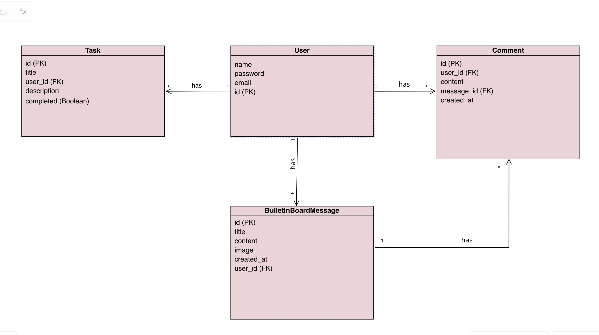

Backend README - Full Stack Bulletin Board

📝 Project Description

This repository contains the backend code for the Full Stack Bulletin Board application. It provides a RESTful API built with Django and Django REST Framework to manage users, tasks, bulletin board messages, and comments. The backend uses PostgreSQL for data persistence and is designed to be containerized using Docker.

Repository Description

This repository holds the Django project, including models, serializers, views (API endpoints), URL configurations, authentication logic (JWT), and Docker configuration for the backend service.

Tech Stack
Language: Python 3.10
Framework: Django, Django REST Framework (DRF)
Authentication: djangorestframework-simplejwt (JWT)
Database: PostgreSQL
Server: Gunicorn
Containerization: Docker

Links
 Frontend Repository: https://github.com/Roqayaalnemary/TaskApp_frontend

Deployed Site: [Link to Deployed Site - Placeholder]

ERD Diagram

API Routing Table (Server)
Based on Django REST Framework DefaultRouter:

| Method | Path                        | ViewSet Action     | Description                                                    |
|--------|-----------------------------|--------------------|----------------------------------------------------------------|
| GET    | /api/tasks/                 | list               | List tasks for the authenticated user.                         |
| POST   | /api/tasks/                 | create             | Create a new task for the authenticated user.                  |
| GET    | /api/tasks/{id}/            | retrieve           | Retrieve a specific task.                                      |
| PUT    | /api/tasks/{id}/            | update             | Update a specific task.                                        |
| PATCH  | /api/tasks/{id}/            | partial_update     | Partially update a specific task.                              |
| DELETE | /api/tasks/{id}/            | destroy            | Delete a specific task.                                        |
| GET    | /api/messages/              | list               | List all bulletin board messages (Public).                     |
| POST   | /api/messages/              | create             | Create a new message (Authenticated).                          |
| GET    | /api/messages/{id}/         | retrieve           | Retrieve a specific message (Public).                          |
| PUT    | /api/messages/{id}/         | update             | Update a specific message (Authenticated).                     |
| PATCH  | /api/messages/{id}/         | partial_update     | Partially update a message (Authenticated).                    |
| DELETE | /api/messages/{id}/         | destroy            | Delete a specific message (Authenticated).                     |
| GET    | /api/messages/{id}/comments/| comments (custom)  | Get comments for a specific message (Public).                  |
| GET    | /api/comments/              | list               | List comments (filter by message_id possible).                 |
| POST   | /api/comments/              | create             | Create a new comment (Authenticated).                          |
| GET    | /api/comments/{id}/         | retrieve           | Retrieve a specific comment.                                   |
| PUT    | /api/comments/{id}/         | update             | Update a specific comment.                                     |
| PATCH  | /api/comments/{id}/         | partial_update     | Partially update a comment.                                    |
| DELETE | /api/comments/{id}/         | destroy            | Delete a specific comment.                                     |
| POST   | /api/register/              | create             | Register a new user (Public).                                  |
| POST   | /api/token/                 | create             | Obtain JWT access and refresh tokens (Public).                 |
| POST   | /api/token/refresh/         | create             | Refresh JWT access token (Public).                             |
| POST   | /api/token/verify/          | create             | Verify JWT token (Public).                                     |

Installation Instructions (Docker)

1- Prerequisites: Docker and Docker Compose must be installed.

2- Clone Repositories: Clone both the backend and frontend repositories into a common parent directory.

git clone <backend-repo-url> backend
git clone <frontend-repo-url> frontend
cd .. # Move to the parent directory 
containing backend/ and frontend/

Environment Variables:
Create a .env file in the parent directory (where docker-compose.yml resides) with the following variables:
env
# Database Settings
DB_NAME=bulletinboard_db
DB_USER=bulletinboard_user
DB_PASSWORD=your_secure_password  # Change this!
SECRET_KEY=your_django_secret_key  # Change this!
DEBUG=1  # Set to 0 for production

4- Build and Run: Use Docker Compose to build the images and start the containers.

docker-compose up --build -d

5- Database Migrations: Apply Django database migrations.

docker-compose exec backend python manage.py migrate

6- Access:
The backend API should be accessible via the frontend (served on http://127.0.0.1:8000/admin/) or directly if proxied/exposed differently

IceBox Features (Future Enhancements)

1- Admin tools enhancement: Improve admin capabilities with AI to analyze data, manage users, and optimize task distribution.

2- AI-powered task suggestions: Suggest tasks to users based on historical data and behavior using AI algorithms.

3- Database optimization: Implement AI techniques for better database query performance and optimization.

4- Image uploads: Allow image uploads through the backend and use AI for image recognition and categorization.